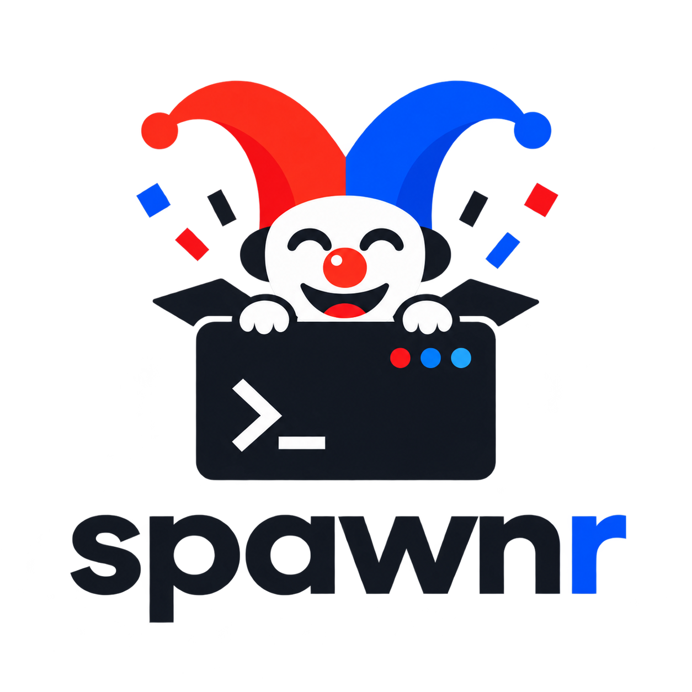

  

<h1 align="center">Spawnr</h1>

  <strong>Create isolated KVM development machines from OCI images.</strong> 
  Keep your workspace across restarts. Keep project tools off your host.

  Early preview · Linux x86_64 · Apache-2.0

## Install

\`\`\`console
$ curl -fsSL https://spawnr-cli.dev/install.sh | sh
$ spawnr setup
$ spawnr doctor
\`\`\`

\`setup\` downloads the versioned runtime that matches the CLI. \`doctor\` checks
your host and the runtime.

## Create a machine

Give Spawnr an OCI image and a Git repository:

\`\`\`console
$ spawnr clone \
    ghcr.io/acme/rust-dev:v1 \
    git@github.com:acme/project.git

✓ created project-1
✓ cloned git@github.com:acme/project.git

$ spawnr open project-1
\`\`\`

The repository is cloned inside the guest. You do not need a checkout on the
host.

The OCI image must contain Git. It must also contain an SSH client when you use
an SSH repository URL.

## How it works

Each machine has three separate domains:

| Domain | Contains | Lifetime |
|---|---|---|
| **Environment** | Packages, tools, and system configuration | Persists and can be published |
| **Workspace** | Source, Git data, and build output | Persists across stops and restarts |
| **Session** | Git identity, tokens, shell history, and SSH-agent access | Exists only while the machine runs |

Spawnr publishes only the environment. It excludes the workspace and session
data by design.

## Why Spawnr

- **KVM isolation:** each development machine runs with Cloud Hypervisor on KVM.
- **Daemonless OCI:** Spawnr pulls and publishes images without Docker Engine,
  Docker CLI, or \`/var/run/docker.sock\`.
- **Host-owned keys:** Spawnr forwards SSH signing requests. It does not copy
  private keys into the guest.
- **Versioned runtime:** the CLI downloads a pinned runtime and verifies its
  size, digest, manifest, and files.

## Core commands

| Command | Action |
|---|---|
| \`spawnr ls\` | List machines |
| \`spawnr open <name>\` | Open an interactive shell |
| \`spawnr start <name>\` | Start a stopped machine |
| \`spawnr stop <name>\` | Stop a machine and keep its data |
| \`spawnr publish <name> <oci-ref>\` | Publish the environment as an OCI image |
| \`spawnr rm <name>\` | Remove a machine after a workspace check |

Create a machine without a repository:

\`\`\`console
$ spawnr init scratch --environment docker.io/library/ubuntu:24.04
$ spawnr start scratch
$ spawnr open scratch
\`\`\`

Publish environment changes:

\`\`\`console
$ spawnr publish project-1 ghcr.io/acme/rust-dev:v2
\`\`\`

## Requirements and current scope

- Linux x86_64.
- Read and write access to \`/dev/kvm\`.
- Linux/amd64 OCI images.
- Outbound networking only.
- No SSH server or IDE Remote SSH integration.
- Publishing requires FUSE and working user namespaces.

Run \`spawnr doctor\` for a precise host report.

> [!IMPORTANT]
> A forwarded SSH agent does not expose private key bytes. Guest code can still
> request signatures while the machine runs. Read the
> [security model](docs/security.md) before you run untrusted code.

## Develop

The Nix flake pins Rust, Cargo dependencies, Cloud Hypervisor, passt, the guest
kernel, BusyBox, the guest agent, and OCI tools.

\`\`\`console
$ nix develop
$ cargo test --workspace --locked
$ nix flake check
\`\`\`

Run the local bundle without replacing an installed release:

\`\`\`console
$ SPAWNR_HOME=/tmp/spawnr-dev nix run . -- doctor
\`\`\`

See [Development](docs/development.md) for build targets and KVM end-to-end
tests.

## Documentation

- [Website and quick start](https://spawnr-cli.dev/)
- [CLI reference](docs/cli.md)
- [Architecture](docs/architecture.md)
- [Security model](docs/security.md)
- [Development and validation](docs/development.md)
- [Release and runtime contract](docs/releases.md)

Spawnr is licensed under [Apache-2.0](LICENSE).
