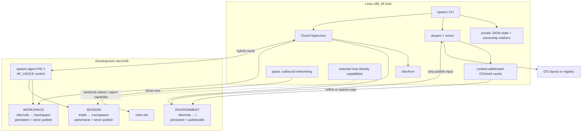

# Architecture

Spawnr implements one deliberately narrow abstraction:

```text
Git → source
OCI → environment
KVM → isolation
workspace disk → project state
session tmpfs → identity capabilities
Spawnr → lifecycle
```

## System overview



The important property is not merely that the three domains use different
directories in the guest. Environment and workspace are different block
devices, and session data is a different filesystem again. The host publishing
API accepts exactly `environment.raw`; it has no workspace or session
parameter.

## Components

The Cargo workspace has three crates:

- `spawnr` is the host CLI. Its modules own lifecycle policy, state, storage,
  OCI conversion, VMM/process management, credentials, and the host side of
  the guest protocol.
- `spawnr-agent` is a small static guest component. It runs as PID 1, configures
  the guest, mounts the workspace and session filesystems, creates `dev`, and
  handles private control requests.
- `spawnr-protocol` contains the versioned JSON control messages and framed
  interactive byte streams shared by host and guest.

There is no host daemon. Each CLI invocation locks and updates local state, and
Cloud Hypervisor plus `passt` are recorded as identity-checked managed
processes.

## OCI environment creation

For a registry reference, creation follows this sequence:

1. Normalize the reference to a `skopeo` transport and resolve its linux/amd64
   manifest digest.
2. Derive a cache key from the source digest, Spawnr version, static guest
   agent, BusyBox, DHCP hook, and integration schema.
3. Pin registry pulls to that digest (and verify local-layout copies) before
   pulling directly into an OCI image layout with `skopeo copy`.
4. Run `umoci unpack` in a subordinate-ID user namespace. This applies normal
   OCI layer, ownership, metadata, symlink, and whiteout semantics without
   requiring a privileged container daemon.
5. Inject the static guest integration into the unpacked filesystem.
6. Use `mkfs.ext4 -d` in the same ownership mapping to materialize a sparse raw
   root filesystem labeled `SPAWNR_ENV`.
7. Atomically install the finished cache entry. Concurrent creation of the
   same environment is serialized with a file lock.
8. Give each machine its own reflink copy of the cached disk where supported;
   otherwise use a sparse extent-aware copy.

The cached base is never attached writable to a VM. A tag is resolved before
cache lookup, so changed tag content produces a different cache key and a tag
move between inspect and copy cannot be committed under the old identity.

`docker://` is the name of `skopeo`'s registry transport. No Docker service,
socket, CLI, or image store participates. Local `oci:/path:tag` layouts are
also accepted. Daemon and host-container-store transports are rejected.

## Machine storage

The default data root is `$XDG_DATA_HOME/spawnr`, or
`$HOME/.local/share/spawnr` when `XDG_DATA_HOME` is unset. A machine is stored
under its internal UUID, never a path derived from its display name:

```text
spawnr/
├── state.json
├── state.lock
├── bin/
├── images/
│   └── <cache-key>/
│       ├── environment.raw
│       ├── layout/
│       └── spawnr-environment.json
└── machines/
    └── <machine-uuid>/
        ├── owner.json
        ├── environment/
        │   ├── domain.json
        │   └── environment.raw
        ├── workspace/
        │   ├── domain.json
        │   └── workspace.raw
        └── session/
            ├── domain.json
            ├── *.pid.json
            ├── *.sock
            └── *.log
```

Directories are private to the host user. Each destructive operation checks an
owner marker containing the Spawnr owner string, machine UUID, and machine
name. Domain markers additionally bind each subdirectory to the machine and
workspace UUID. Spawnr refuses to adopt or remove paths that do not match.

The environment disk has a 32 GiB sparse logical capacity by default (or more
for a large unpacked image); the workspace disk has a 64 GiB sparse logical
capacity. Logical size is not equal to immediate host allocation.

## Boot and guest initialization

Cloud Hypervisor starts with four vCPUs, 4 GiB shared memory, two raw virtio
block disks, a vhost-user network device, a hybrid-vsock device, RNG, and a
private API socket. It uses KVM directly.

The initramfs loads the virtio PCI, block, network, console, vsock, ext4, and
packet modules. It mounts `/dev/vda`, moves the pseudo-filesystems into the
new root, and executes `/usr/libexec/spawnr-agent` as PID 1. Container
entrypoint/CMD and a source image's init system are not required.

The agent then:

1. sets the guest hostname from the Spawnr machine name;
2. finishes `/run`, `/dev/pts`, loopback, DHCP, and DNS setup;
3. creates the `dev` account and installs its passwordless sudo policy;
4. resolves the block filesystem labeled `SPAWNR_WORKSPACE`, mounts it at the
   exact `/workspace` mount point, and proves its device differs from `/`;
5. mounts `/run/spawnr` as a `nosuid,nodev` tmpfs; and
6. listens on AF_VSOCK port 19870.

The health response includes the protocol version, hostname, and whether the
workspace separation proof holds. A start is successful only after the agent
answers health checks.

## Control plane and interactive access

Cloud Hypervisor's hybrid-vsock backend is represented by a Unix socket inside
the private machine session directory. The host connects and requests vsock
port 19870, then exchanges four-byte-length-prefixed JSON control frames.

Supported requests include health, session configuration, clone, non-TTY and
PTY exec, workspace Git status, and shutdown. Each accepted connection runs in
its own guest thread, so an interactive session does not block health or
shutdown requests. PTY data, resize notifications, signals, and exit status
use a bounded binary frame format.

`spawnr open` starts a stopped VM, opens `/bin/bash -l` as `dev`, and selects
`/workspace/<repository>` as its working directory when applicable. This path
is private vsock access, not an exposed network management service. Bash
receives `HISTFILE=/run/spawnr/bash-history`, placing ordinary history in
session tmpfs rather than the publishable home directory. An image-controlled
login profile can override that environment variable.

## Networking

`passt` supplies rootless vhost-user virtio networking. DHCP and DNS are
configured by the static guest tooling. Incoming TCP and UDP forwarding are
explicitly set to `none`, and passt's host-gateway mapping is disabled.
Management never depends on guest IP networking.

## Publishing

Publishing first stops a running VM to obtain a consistent ext4 image, and
attempts to restore its prior running state after the publish attempt. The
pipeline is:

1. Validate ownership/domain markers and accept only the machine's environment
   disk.
2. Run `e2fsck` on that disk.
3. Copy the original content-addressed OCI layout and unpack its base with
   `umoci` inside a mapped user namespace.
4. Read-only mount `environment.raw` over the unpacked root with `fuse2fs`.
5. Run `umoci repack --no-mask-volumes`, which compares the complete
   environment filesystem with the original OCI metadata and creates a normal
   delta layer, including correct whiteouts, modes, ownership, symlinks, and
   mutations beneath image-declared `VOLUME` paths.
6. Push the resulting image with `skopeo copy` to a registry or OCI layout.

Workspace storage never appears in this function signature or subprocess
argument list. Guest session tmpfs never resides on the environment block
device. This is the core publish-safety property.

## Lifecycle and failure handling

State is JSON protected by an exclusive `flock` and saved with a synced
temporary file plus atomic rename. `open` releases that lock after lifecycle
setup and before attaching the unbounded interactive shell. Machine creation
cleans partially created storage; multi-clone rollback keeps any state record
whose owned resources could not be proven removed.

Managed process records contain the PID, host boot ID, procfs start tick, and
executable device/inode. Signals are sent through a pidfd where available, and
Spawnr refuses to treat a reused PID as one of its helpers. Stop asks the guest
to power off, then uses Cloud Hypervisor's API before bounded termination.
Cloud Hypervisor and `passt` must both be live for a machine to report
`running`; a one-sided runtime reports `degraded` and is repaired on start.
Passt runs in one-client mode so it exits when its VMM disappears. Stale
process files and a surviving helper are handled during the next lifecycle
operation.
